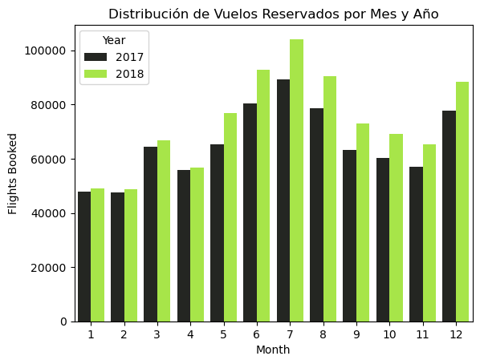
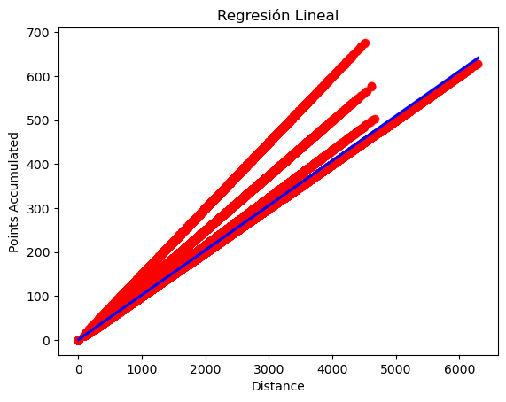
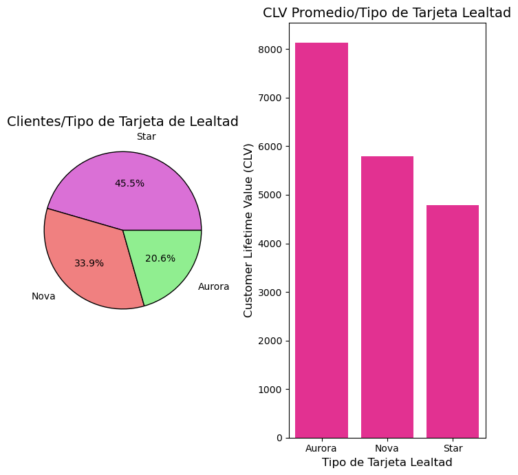
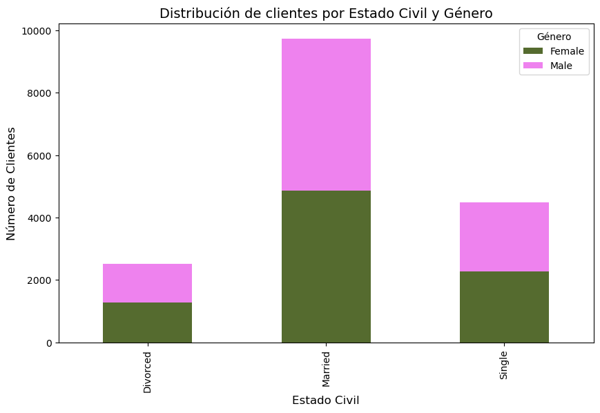

# 🧠 Análisis de Comportamiento de Clientes en Programa de Lealtad - Aerolínea

**Evaluación Final | DA Módulo 3**

Este proyecto analiza el comportamiento de los clientes dentro de un programa de lealtad de una aerolínea. A través de la exploración y visualización de datos, se identifican patrones clave sobre reservas, uso de puntos, y características demográficas de los clientes.

---

## 📁 Conjuntos de Datos

### `Customer Flight Analysis.csv`
Contiene información mensual de actividad de vuelo por cliente:
- **Loyalty Number**: Identificador único del cliente
- **Year, Month**: Fecha de actividad
- **Flights Booked, Total Flights, Flights with Companions**
- **Distance**
- **Points Accumulated, Points Redeemed**
- **Dollar Cost Points Redeemed**

### `Customer Loyalty History.csv`
Contiene el perfil completo del cliente:
- **Localización**: Country, Province, City, Postal Code
- **Demografía**: Gender, Education, Salary, Marital Status
- **Programa de Lealtad**: Loyalty Card, CLV, Enrollment/Cancellation Dates

---

## 🧪 Fase 1: Exploración y Limpieza

### 🔍 Exploración Inicial
Se usaron funciones de Pandas para:
- Verificar estructura general de los datos (`.info()`, `.describe()`, `.isnull()`)
- Identificar valores faltantes y posibles atípicos
- Unir los datasets usando `Loyalty Number`

### 🧹 Limpieza de Datos
- Eliminación de filas con valores nulos en columnas clave
- Conversión de fechas y campos numéricos al tipo correcto
- Verificación de consistencia entre columnas

---

## 📊 Fase 2: Visualización de Datos

Visualizaciones generadas para responder preguntas clave. Las gráficas están disponibles en la carpeta `/graficas`.

### 1️⃣ ¿Cómo se distribuye la cantidad de vuelos reservados por mes durante el año?

📈  
*Gráfico de barras*  


---

### 2️⃣ ¿Existe relación entre la distancia de los vuelos y los puntos acumulados?

📉  
*Gráfico de dispersión con línea de regresión*  


---

### 3️⃣ ¿Cuál es la distribución de los clientes por provincia o estado?
*Ejemplo de código utilizado para la gráfica, en este caso tipo "pie"*
📍  
```python

df_no_duplicates = df_union.drop_duplicates(subset=['Loyalty Number'])


df_no_duplicates['Province'].value_counts().plot.pie(
    autopct='%1.1f%%', 
    colors=['mediumpurple', 'darkcyan', 'greenyellow'], 
    figsize=(9, 9),         
    labeldistance=1.3       
)

# Título y formato
plt.title("Distribución de clientes por Provincias")
plt.ylabel("")  


### 4️⃣ ¿Cómo se compara el salario promedio entre los diferentes niveles educativos?

📊  
*Ejemplo de código utilizado para la gráfica, en este caso Barplot* 
```python
sns.barplot(x='Education', y='Salary', data=salario_promedio_educacion, palette='viridis')

plt.title("Salario Promedio por Nivel Educativo")
plt.xlabel("Education")
plt.ylabel("Salary")


sns.barplot(x='Education', y='Salary', data=salario_promedio_educacion, palette='viridis')

plt.title("Salario Promedio por Nivel Educativo")
plt.xlabel("Education")
plt.ylabel("Salary")


### 5️⃣ ¿Cuál es la proporción de clientes según el tipo de tarjeta de fidelidad?

🥇  
*Gráfico de pastel o barras*  


---

### 6️⃣ ¿Cómo se distribuyen los clientes según estado civil y género?

👥  
*Gráfico de barras agrupadas o heatmap*  


---

## 📌 Conclusiones Clave

- Hay estacionalidad clara en las reservas mensuales.
- Existe una correlación significativa entre la distancia volada y los puntos acumulados.
- Las tarjetas “Aurora” y “Nova” concentran a los clientes de mayor CLV.
- El nivel educativo se relaciona con un mayor salario promedio.


## 📁 Estructura del Proyecto

- `EDA.ipynb` – Notebook con todo el análisis.
- `Archivos` – Carpeta con visualizaciones generadas y los datasets originales.
- `README.md` – Este documento.
